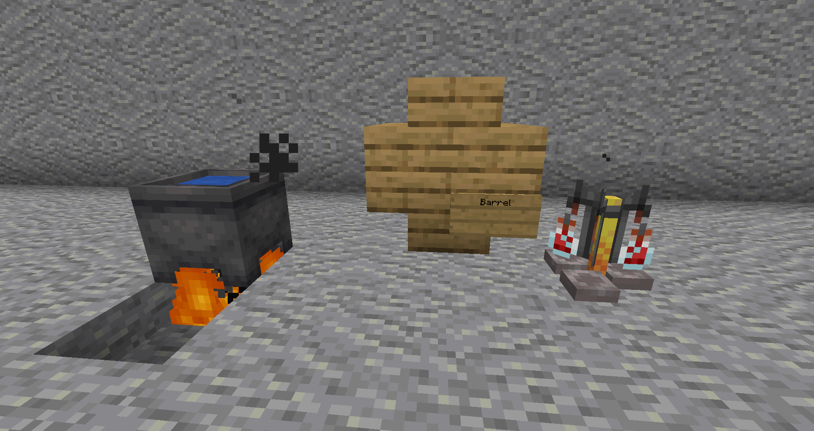
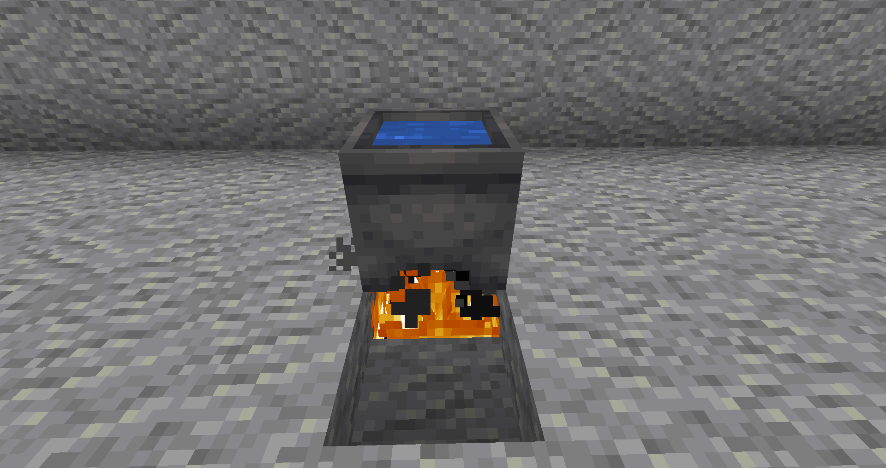
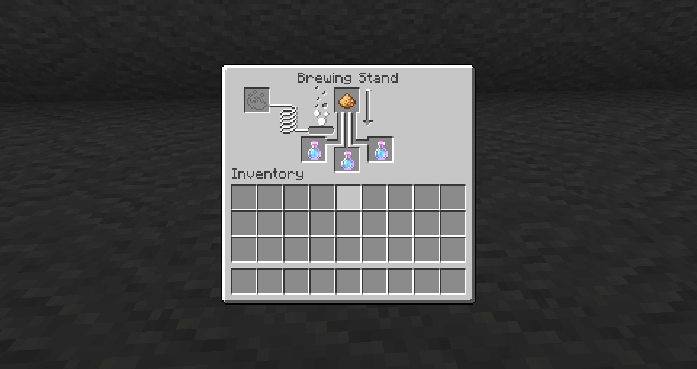
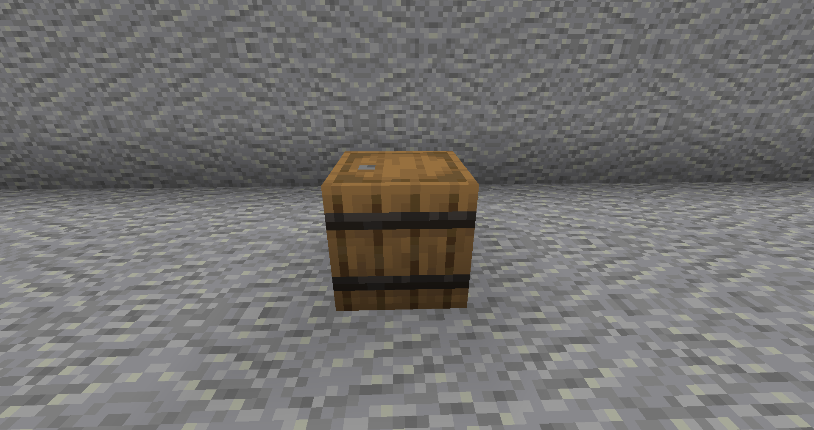
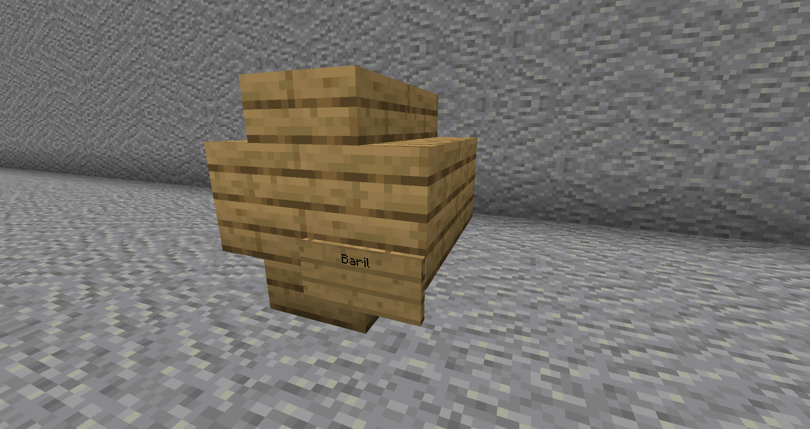
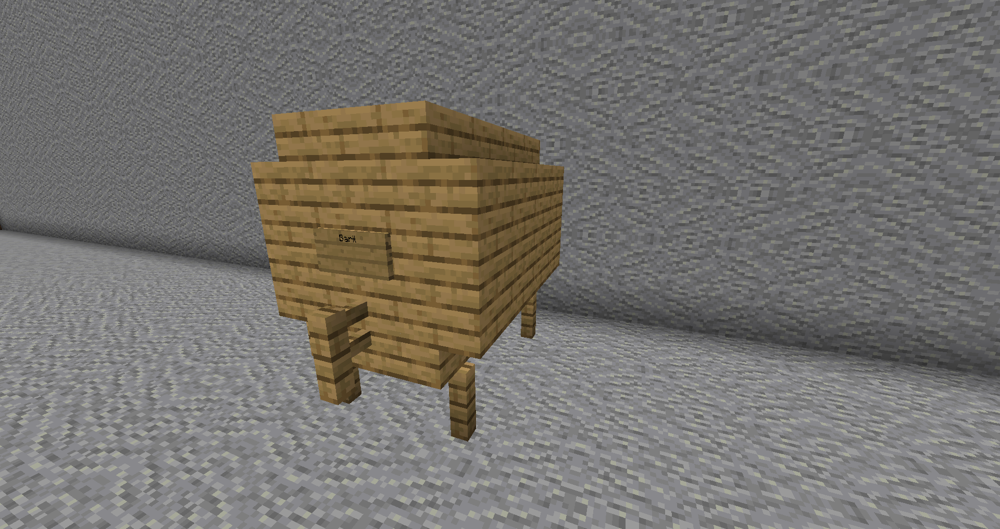
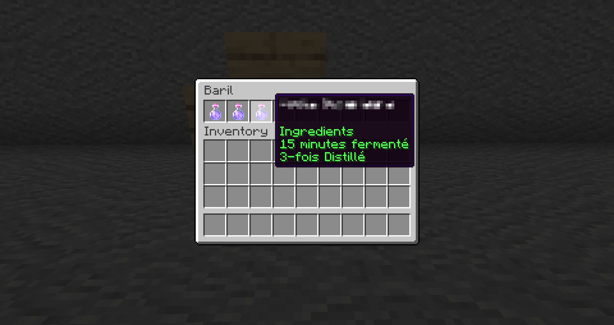

# Brasserie

La préparation de boissons se fait en plusieurs étapes:

1. Fermentation
2. Distillation
3. Vieillissement

Il existe différentes boissons alcoolisées ou non. Cependant il faut suivre une recette bien précise. Vous pouvez obtenir des livres de recette en faisant des challenges/quêtes.

## Fermentation 

Tout d'abord, créez un chaudron chauffé afin de faire fermenter vos ingrédients. ajouter vos ingrédients en faisant **clique droit**. Attendez quelques minutes et récupérez le résultat dans des bouteilles en verre.


Vous pouvez faire **clique droit** avec une montre pour savoir le temps de fermentation.


## Distillation 

Ensuite, faites distiller le résultat dans un **alambique** \(_**brewing stand**_\) avec de la **poudre lumineuse** \(_**glowstone**_\). Vous pouvez distiller autant de fois que vous le souhaitez.


La **poudre lumineuse** \(_**glowstone**_\) ne sera pas consommé.



Toutes les boissons n'ont pas besoins d'être distillées.


## Vieillissement 

Le vieillissement peut se faire dans différents tonneaux : 




Le tonneau de base de Minecraft.





* 8 Escaliers
* 1 Panneau \(écrivez **"Baril"** sur la première ligne\)

Dimensions 5x4x4 \(panneau pris en compte\)




* 16 Escaliers
* 16 Planches
* 5 Barrières 
* 1 Panneau \(écrivez **"Baril"** sur la première ligne\)

Dimensions 5x3x4




Les moyens et grands tonneaux peuvent être fait de n'importe quel type de bois ce qui peut influencer le vieillissement de certaines boissons.



Toutes les boissons n'ont pas besoins d'être distillées.


Les boissons peuvent être stocker dans les tonneaux où elles prendront de l'age.


Certaines boissons peuvent avoir une forte concentration d'alcool se qui peut vous rendre ivre et vous donner plusieurs effets :

* Modification de certains messages dans le chat
* Vous fait marcher aléatoirement
* Vomissement
* Vous faire évanouir \(vous déconnectera\)
* Effets de potions
* "Gueule de bois" \(quand les effets se seront dissipés\)



Pour devenir sobre vous pouvez :

* Attendre 
* Vous déconnecter \(il se peut qu'à votre reconnexion vous soyez téléporté à votre point de spawn ou aléatoirement\)
* Consommer du lait et du pain


