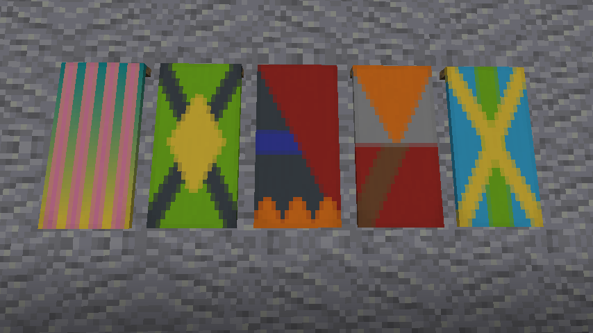
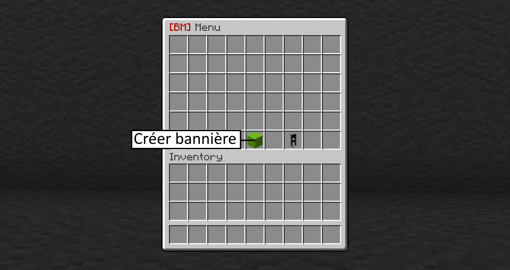
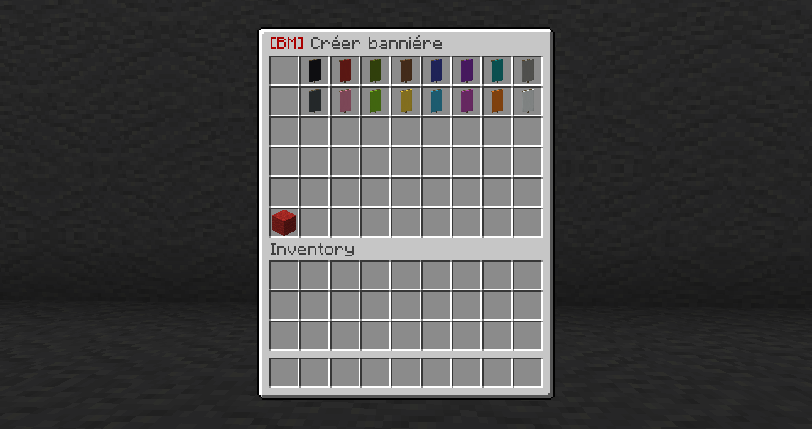
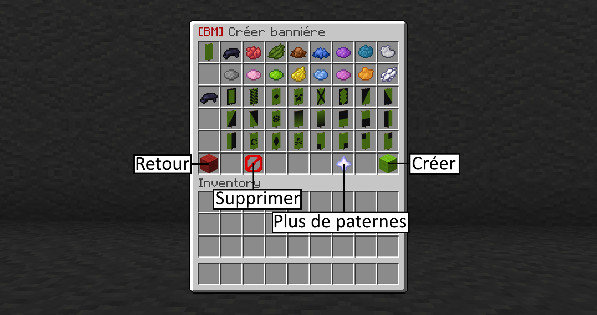
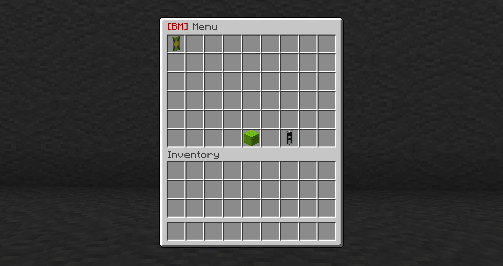
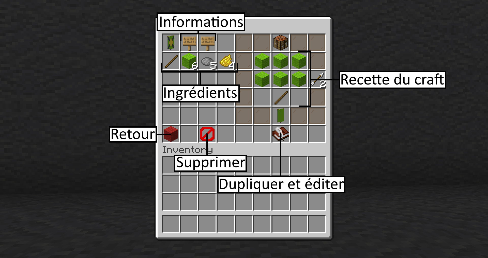

# Fabricant de bannières

## Utilisation

Pour l'utiliser faites la commande _**/bannermaker**_ \(_**/bm**_\), vous arriverez alors à cette interface. Cliquez sur **"Créer bannière".**

Ici choisissez la couleur de font de votre bannière.

Enfin vous pouvez ajouter des paternes à votre bannière en choisissant d'abord la couleur puis le motif.


Vous pouvez mettre que 6 paternes à la fois sur une bannière


Une fois validé votre bannière se retrouve au menu principal.

Cliquez dessus et vous pourrez accéder à sa recette et au nombre d'ingrédients qu'il faut pour la construire.


Il existe une page dans le menu principal \(_**/bm**_\) ou vous pouvez avoir des bannières de lettres et de chiffres déjà fait


